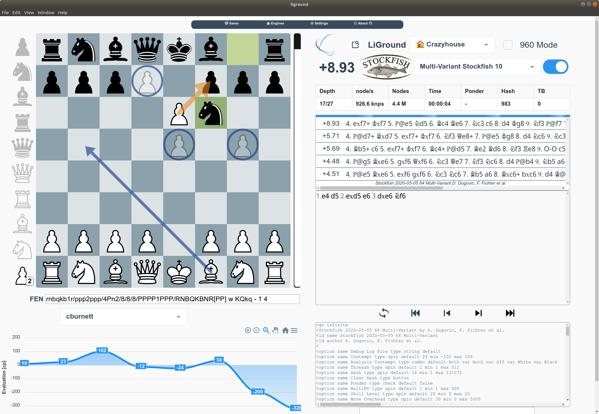

# LiGround

> A free, open-source and modern Chess Variant Analysis GUI for the 21st century


<!--  -->

## Supported Games

### Regional and Historical Games
- [Chess](https://en.wikipedia.org/wiki/Chess)
- [Janggi](https://en.wikipedia.org/wiki/Janggi)
- [Makruk](https://en.wikipedia.org/wiki/Makruk)
- [Shogi](https://en.wikipedia.org/wiki/Shogi)
- [Xiangqi](https://en.wikipedia.org/wiki/Xiangqi)

### Chess Variants

- [Antichess](https://lichess.org/variant/antichess)
- [Atomic](https://en.wikipedia.org/wiki/Atomic_chess)
- [Chess960](https://en.wikipedia.org/wiki/Chess960)
- [Crazyhouse](https://en.wikipedia.org/wiki/Crazyhouse)
- [Horde](https://en.wikipedia.org/wiki/Dunsany%27s_Chess#Horde_Chess)
- [King of the Hill](https://en.wikipedia.org/wiki/King_of_the_Hill_(chess))
- [Racing Kings](https://en.wikipedia.org/wiki/V._R._Parton#Racing_Kings)
- [Three-check](https://en.wikipedia.org/wiki/Three-check_chess)

## Build Instructions

### Build Setup
``` bash
# install dependencies
npm install

# run dev server with hot reload at localhost:9080
npm run dev

# build electron application for production
npm run build

# lint all JS/Vue component files
npm run lint
```

### Post-Installation Actions
LiGround ships with preincluded engine binaries. By default all engines are downloaded automatically into the `./engines/` folder as postinstall action. However, if no prebuilt binaries are available for you system or something goes wrong, please go ahead and build/download them manually:

* Download [Stockfish 2020-06-13](https://github.com/niklasf/Stockfish/releases/fishnet-20200613) and rename it to `stockfish`
* Download [Multi-Variant-Stockfish 10](https://github.com/ddugovic/Stockfish/releases/variant_sf_10) and rename it to `multi-variant-stockfish`
* Download [Fairy-Stockfish 13 **Largeboard**](https://github.com/ianfab/Fairy-Stockfish/releases/fairy_sf_13) and rename it to `fairy-stockfish`

### Libraries
The following libraries or assets are used in **LiGround**:

Library | Description | Usage
--- | --- | ---
[**ffish.js**](https://www.npmjs.com/package/ffish) | A high performance WebAssembly chess variant library based on [_Fairy-Stockfish_](https://github.com/ianfab/Fairy-Stockfish). | Used in the GUI for legal move generation, FEN parsing & validation, pocket pieces, etc.
[**ChessgroundX**](https://github.com/gbtami/chessgroundx) | A free/libre open source chess UI developed for [lichess.org](https://lichess.org/) and [pychess.org](https://www.pychess.org/). | Used as the main UI board element.
[**ornicar/lila**](https://github.com/ornicar/lila) | The forever free, adless and open source chess server | Many high quality assets from [lichess.org](https://lichess.org/) (e.g. piece styles, board styles, chess fonts, ...) are used within this GUI.
[**Vue.js**](https://vuejs.org/) | The Progressive JavaScript Framework | Used as the main JavaScript Framework.
[**Electron**](https://www.electronjs.org/) | Build cross-platform desktop apps with JavaScript, HTML, and CSS | Used for exporting the GUI to the desktop.
[**electron-vue**](https://github.com/SimulatedGREG/electron-vue) | An Electron & Vue.js quick start boilerplate | Used for the boilerplate code.

### Related
Projects that influenced the creation of **LiGround**:

Project | Description
--- | ---
[**tinyChessServer**](https://github.com/MoritzWillig/tinyChessServer) | An xboard server for playing bughouse games via websockets
[**lichess.org/analysis**](https://lichess.org/analysis) | The forever free, adless and open source chess server
[**vue-chessboard**](https://github.com/vitogit/vue-chessboard) | Chessboard vue component to load positions, create positions and see threats
[**cutechess**](https://github.com/cutechess/cutechess) | A graphical user interface, command-line interface and a library for playing chess.
[**XBoard**](https://www.gnu.org/software/xboard/) / [**WinBoard**](http://hgm.nubati.net/) | A graphical user interface for chess in all its major forms.
[**Nibbler**](https://github.com/fohristiwhirl/nibbler) | Leela Chess Zero (Lc0) interface.
[**chess.js**](https://github.com/jhlywa/chess.js) |  A Javascript chess library for chess move generation/validation, piece placement/movement, and check/checkmate/draw detection

---

This project was generated with [electron-vue](https://github.com/SimulatedGREG/electron-vue)@[45a3e22](https://github.com/SimulatedGREG/electron-vue/tree/45a3e224e7bb8fc71909021ccfdcfec0f461f634) using [vue-cli](https://github.com/vuejs/vue-cli). Documentation about the original structure can be found [here](https://simulatedgreg.gitbooks.io/electron-vue/content/index.html).
